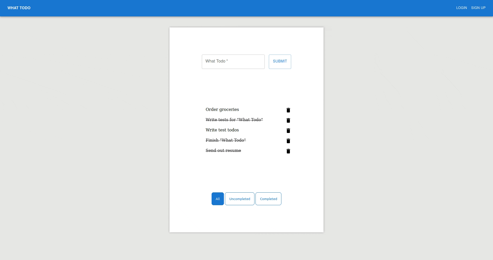

# What-todo (Frontend)

A simple frontend React/Firescript application used to create, edit, and delete personal todos. Styled with MaterialUI.

Visit the live app [here](https://neptunerjo.github.io/what-todo/)

# Installation and Setup

- Clone this repository, or download the zip file and open it with your preferred IDE
- Run `npm install` to install required dependencies
- To start the server, run `npm start` and visit the app at `http://localhost:3000`

# Reflection

What todo is a personal-learning project built to coincide with [The Odin Project's](https://www.theodinproject.com/) Firebase lessons. The goal of this project was to familiarize myself with Firebase and reinforcing my React skills.

The main challenge with this build was learning Firebase with no prior BaaS experience. Figuring out authorization and user-specific data was a little tricky, but this project definetly set me up for learning Node in the future.

At the end of the day, the main technologies used to create this project are React, Firebase, React-Router, and MaterialUI. `create-react-app` boilerplate was used to minimize setup time.
