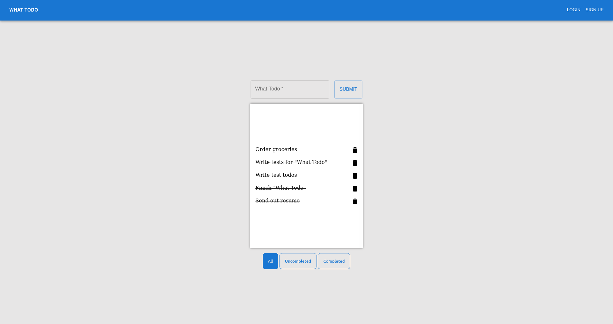
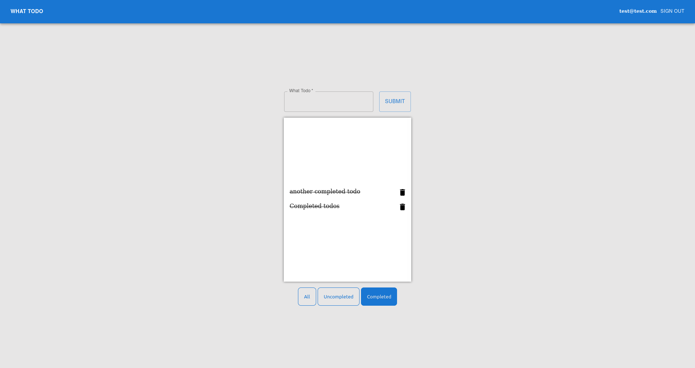

## What-Todo

What Todo is a todo-list web application that utilizes `Firebase` for the backend and `MaterialUI` / `React` for the frontend.

## Demo Link:

Access my site at [https://neptunerjo.github.io/what-todo/](https://neptunerjo.github.io/what-todo/)

## Table of Content:

- [Screenshots](#screenshots)
- [Technologies](#technologies)
- [Setup](#setup)
- [Approach](#approach)

## Screenshots

## Technologies

Built with `React`, `CSS3`, `MaterialUI`, and `Firebase`.

## Setup

- Download or clone the repository
- Run `npm install`
- Run `npm start` to view a local version on `http://localhost:3000/`

## Approach

Google's `Firebase` was used to supply the back-end services, storing both the database and user data.
Todos can be added, deleted, and marked for completion on the fly for any unique user.

The todos are collected based on the id of the current user (there is a default, anonymous value)
and the UI that allows users to sort through todos based on whether is complete or not is handled in `React` to minimize data collection.

In order to edit the todo data easier, `UUIDV4` was used to create unique id values for each todo created. By using UUID, I can store the id of the object as a value, so it can be accessed without making any additional calls.
